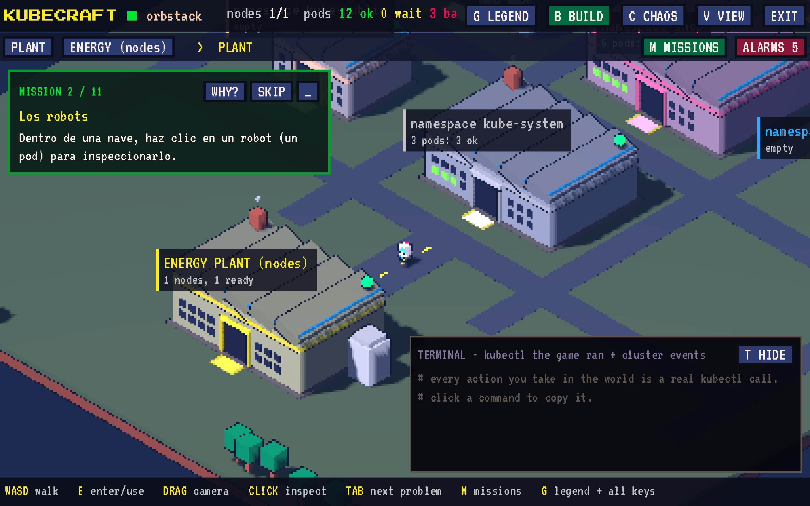
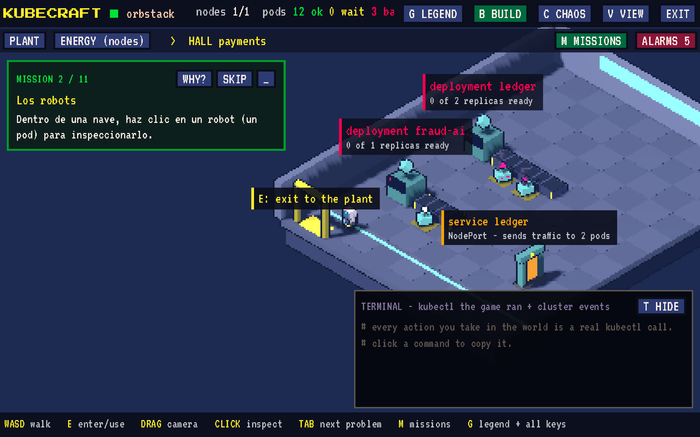
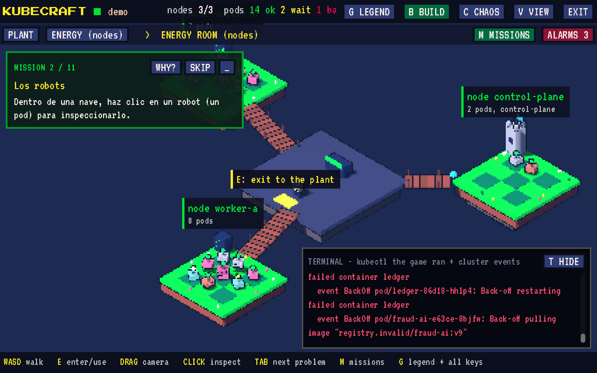

# Kubiverse

Your **real** Kubernetes cluster turned into a pixel‑art (voxel) 3D world you can walk around and operate.

**[Play the demo in your browser](https://jairofernandez.github.io/kubiverse/?demo=1)** (simulated cluster) · **[Download the latest release](https://github.com/jairoFernandez/kubiverse/releases/latest)** (macOS, Linux, Windows and the bridge)



- **Engine:** Godot 4.7 (GDScript, *Compatibility* renderer) → exports to **Web (WASM)**, **macOS**, **Linux** and **Windows** from the same project.
- **3D pixel‑art look:** the 3D world renders into a `SubViewport` at 1/3 resolution and is upscaled with *nearest* filtering; toon materials with the PICO‑8 palette, *inverted hull* outlines, orthographic isometric camera with *pixel snapping*.
- **Cluster connection:** `k8s-bridge`, a Go binary (client-go) that reads your kubeconfig, keeps *informers* running and talks to the game over HTTP + WebSocket.

```
┌──────────────┐  WebSocket (snapshots + events)   ┌─────────────┐  client-go / informers  ┌──────────────┐
│  Kubiverse   │ ◄──────────────────────────────── │ k8s-bridge  │ ◄─────────────────────► │ kube-apiserver│
│(web/native)  │ ──── HTTP /api/action, /api/logs ─►│  (Go)       │     (your kubeconfig)   │   (real)      │
└──────────────┘                                    └─────────────┘                         └──────────────┘
```

Why a bridge? A browser can't talk to the API server directly (CORS, client certificates, EKS/GKE/AKS `exec` plugins). With the bridge, the web and native builds use exactly the same protocol and authentication stays on your machine.

## Play with your cluster

Run the bridge on your machine (it uses your kubeconfig, like kubectl). These commands download the latest release, check its SHA256 against the release's `SHA256SUMS.txt` and start it ([`get-bridge.sh`](bridge/get-bridge.sh), [`get-bridge.ps1`](bridge/get-bridge.ps1)); the binary is kept in `~/.kubecraft/bin/`:

```bash
curl -fsSL https://raw.githubusercontent.com/jairoFernandez/kubiverse/main/bridge/get-bridge.sh | sh
```

```powershell
& ([scriptblock]::Create((irm https://raw.githubusercontent.com/jairoFernandez/kubiverse/main/bridge/get-bridge.ps1)))
```

Then open **http://127.0.0.1:8088**: the bridge carries the game inside. To use the [online version](https://jairofernandez.github.io/kubiverse/) instead, add `--allow-origin https://jairofernandez.github.io` to the command (after `sh -s --` on macOS/Linux). The game's start screen shows these commands ready to copy, with the right origin.

The native apps (smoother than the browser) are in the [latest release](https://github.com/jairoFernandez/kubiverse/releases/latest); the web start screen links them under **+ NATIVE APP**, with how to open each one:

- **macOS** (`kubiverse-macos.zip`): unzip and move Kubiverse.app to Applications. It isn't notarized, so the first time use right-click → Open (or System Settings → Privacy & Security → Open Anyway).
- **Windows** (`kubiverse-windows-x86_64.zip`): unzip and run Kubiverse.exe; if SmartScreen stops it, More info → Run anyway.
- **Linux** (`kubiverse-linux-x86_64.tar.gz`): `tar xzf kubiverse-linux-x86_64.tar.gz && ./kubiverse.x86_64`.

They connect to the bridge on `http://127.0.0.1:8088` (started with the command above, no `--allow-origin` needed).

## Intro

While loading, the web build shows its own screen ([`game/web/shell.html`](game/web/shell.html)): the logo, Kubi, a pixel-art city with requests flying around, a bar with the MB downloaded and rotating tips, in English or Spanish depending on the browser. The native build boots with [`game/assets/splash.png`](game/assets/splash.png).

When you connect a cluster, a ~14 s fly-through introduces the world: the logo over the Internet globe, the city with your domains, the Ingress gate and the plant; at the end Kubi says hi. Any key or tap skips it. In **VIEW** you can turn it off (**Intro when connecting**) or watch it again (**PLAY INTRO**). Local data still lives in `~/.kubecraft` (the project's former name) so no settings are lost.

## The factory: levels

| Level | What you see |
|---|---|
| **PLANT** (overview) | One **factory hall per Namespace** (empty ones too) + the **energy plant** (nodes). An at-a-glance monitor: lit windows = pods (green ok, red failing), roof light = worst state inside, red smoke = crashes. |
| **HALL `<ns>`** (sublevel) | Each **Deployment / StatefulSet / DaemonSet** is an **assembly line**: a console with one lamp per replica (green = ready) and a belt that only runs when replicas are ready. Each **Pod** is a **robot** at its station (one block per container, gem = status). Each **Service** is a **loading dock**; hovering or selecting it draws the traffic lines to its pods. |
| **ENERGY ROOM** | Each **Node** is a generator island with the pods physically running on it. Castle = control-plane, fence = cordoned, red light = NotReady, cloud = pods waiting for the scheduler. |

To go in or out, just **step on the door mat** (or press E, double-click a hall, or use the level bar). You start on the main street between the halls, and when you leave a hall you appear in front of its door. Stepping onto an island or entering a hall shows a **zone sign** explaining what it is (control-plane, worker or namespace), and the level bar shows where you are. Warp pipes and kiosks are used with E. The character respects physical limits: it only walks on real ground (terrain, hall floors, islands and bridges) and doesn't walk through halls, consoles, belts or docks.




## Multiple clusters and kubeconfigs

A single bridge serves **every context** in your kubeconfig plus the kubeconfigs you add from the game. Each cluster connects on demand and the game picks one with `?context=`.

On the start screen:
- **Saved clusters**: name, bridge URL, context and token (stored in the game preferences). Click to connect, X to delete.
- **New connection**: bridge URL and **LOAD CONTEXTS**. Pick one and use **SAVE & CONNECT**.
- **+ Add a kubeconfig**: paste it, or **LOAD FILE...** (native picker, or the browser's in the web build), give it a name and press **ADD CLUSTER**. The kubeconfig is only sent to the bridge, which stores it in `~/.kubecraft/kubeconfigs/` with 0600 permissions. The game checks that the cluster responds, **saves it to the list** and **connects**; if it fails, it shows the server error. If one of its contexts has the same name as one you already have (typically `default`, `kubernetes-admin@kubernetes`), it shows up as `file-name/context` instead of being hidden. Careful: just like with kubectl, a kubeconfig with `exec` plugins (aws, gke-gcloud-auth-plugin...) runs that command on the bridge host.

API: `GET /api/contexts`, `POST /api/kubeconfig {name, content}` and `DELETE /api/kubeconfig?name=`. Every cluster route accepts `?context=`.

## Multi-node scenario (kind)

```bash
make cluster         # kind: 1 control-plane + 3 workers (one tainted "GPU") + metrics-server + scenario
make serve-web-kind  # bridge on :8089 against kind-kubecraft -> http://127.0.0.1:8089
make cluster-delete
make cluster-ha      # kind HA: 3 control-planes + 2 workers (etcd plaza) + auditing for the watchtower
make cluster-ha-delete
```

### Multiple control-planes (HA)

With 2 or more control-planes the energy room shows the **etcd plaza**: one crystal per member (green = Ready, red = down) and a sign with the quorum (`3 of 3 members up, needs 2 to work, tolerates 1 failure`). The usual numbers are 3 or 5 (odd, for etcd quorum).

A control-plane's inspector has a **+ CONTROL-PLANE** button. In demo mode it adds one instantly; on a real cluster it opens a guide with the steps for kind, managed clusters (EKS/GKE/AKS: the provider manages them) and kubeadm (`kubeadm token create --print-join-command` + `kubeadm init phase upload-certs --upload-certs` + `kubeadm join ... --control-plane`). Adding a control-plane is an infrastructure operation: the Kubernetes API can't do it, so the game doesn't pretend to.

[`bridge/scenarios/complex.yaml`](bridge/scenarios/complex.yaml) creates five namespaces:

- **ecommerce**: a shop with replicas spread across nodes, an API with a sidecar, workers, Postgres with a volume, and Redis.
- **data**: a 3-broker StatefulSet, a CronJob every 2 min (Completed pods) and a Job.
- **ml**: training pinned to the GPU node (taint + toleration), a model with a broken image and a pod that asks for 64 CPUs and **never** gets scheduled.
- **observability**: a DaemonSet on every node and Prometheus.
- **chaos**: random crashes and an OOMKilled pod.

Your current kubectl context doesn't change.

## Mario-style energy room

By default, **plank bridges** with gentle steps lead to each island without jumping. The Mario-style platforming challenge is enabled in **VIEW → Jump challenge**. The **control-plane** is the central island and where you spawn; workers orbit around it at different heights. If the cluster doesn't expose its control-plane (EKS, GKE...), the center is a neutral platform. Each island has a **warp pipe** (E next to it; you sink into it, fade out and come out of the next island's pipe) and a **terminal kiosk** (E) that opens the terminal already running that node's commands: its pods and `describe node`, or `get nodes` and `cluster-info` on the control-plane. To go on foot you have to **jump** across "?" blocks, bricks and platforms (some move up and down), collecting coins. If you fall into the void you return to the last platform you stood on. There's *coyote time* (you can jump a moment after leaving an edge) and a jump pressed just before landing also counts. Physics are truly vertical: the edges of a higher platform act as walls, and the shadow marks where you'll land. A test checks that every island is reachable with the character's jump.

## Plant districts

The plant groups namespaces into districts, each with its own ground, entrance arch and sign:

- **Kubernetes Quarter** (west): `kube-system`, `kube-public`, `kube-node-lease`, `default` and cluster networking/storage (calico, cilium, metallb, local-path…). Fortress-shaped buildings.
- **Your Apps** (center, facing the Ingress gate): everything else.
- **Platform Park** (east): GitOps (argocd, flux), kubefirst/konstruct, secrets (vault, external-secrets), cert-manager, ingress/mesh (ingress-nginx, traefik, istio…), CI/CD, policies and backups.
- **Observatory Hill** (east): metrics (monitoring, prometheus), grafana, logs and search (elastic, loki…), tracing.

Known types have their own shape and pixel logo: a lighthouse for GitOps, a crane for kubefirst/konstruct and CI, a vault for secrets, an arch for ingress, an observatory dome for metrics, screens with charts for grafana, shelves for logs, a shop awning for `shop`, bank columns for `payments`, silos for data… The catalog lives in [`game/scripts/ns_catalog.gd`](game/scripts/ns_catalog.gd); the logos are generic pictograms, not each project's trademark.

## The Internet city: how the cluster connects to the world

North of the plant lies **THE INTERNET**: a city of skyscrapers under a glowing globe raining data packets.

- Each Ingress **domain** is a **neon sign** (with a golden padlock if it uses HTTPS).
- **Cars are requests**: they leave the sign, pass through the **INGRESS gate** at the plant entrance and drive the streets to the hall of the namespace whose Service answers.
- If the Service **doesn't exist or has no ready pods**, the car stops at the gate with red smoke and a **503**; the gate light turns red.
- **LoadBalancer** Services get their own **pink toll road**, showing the external IP.
- With no Ingress or LoadBalancer, the barrier is down: nothing in the cluster is reachable from outside.
- Click the gate: controller, address and every `domain/path -> namespace/service:port` route with its status.

`make scenario` creates three sample Ingresses in the kind cluster, one broken on purpose.

## Finished pods (Completed)

Argo Workflows, Jobs and CronJobs leave **Completed** pods behind. Kubernetes only collects them once the cluster exceeds 12,500 terminated pods (`--terminated-pod-gc-threshold`), so they pile up.

- The game only draws the **8 most recent per hall** (2 per node in the energy room); the rest go to an **ARCHIVE pile** with a counter. To see them all: VIEW > Show every finished pod.
- With 30 or more in a namespace, **Kubi** warns you ("Many finished pods"): explains why it happens, gives the config to clean them up automatically (Argo `podGC` / `ttlStrategy`, Jobs `ttlSecondsAfterFinished`, CronJobs `*HistoryLimit`) and offers **Clean finished pods** (`kubectl delete pods --field-selector=status.phase==Succeeded`, with confirmation; running pods are left alone).

## Missions (J): production or sandbox

The first time you connect to a cluster the game asks **what kind of cluster it is**, and remembers it per bridge + context. A badge in the top bar always shows it (**PRODUCTION** in red, **SANDBOX** in green); click it to change it. The demo is always a sandbox.

- **Production**: read-only missions to know the cluster, hunt bottlenecks and anomalies, respond to incidents and check observability: census (F3), the machines, the node with the most CPU reserved, Pending pods, the pod with the most restarts (logs `--previous`), incident response with Kubi, hot spots (`top`, events), the Ingress front door and the watchtower. Nothing in them changes the cluster. Every change you make anyway (buttons, terminal, YAML editor, Kubi) asks first in a dialog that says **PRODUCTION**; chaos mode and weapons are off.
- **Sandbox**, in three levels:
  - **Basic**: the 11-mission tour (namespaces, pods, nodes, create a Deployment, self-healing, scaling, Services, logs, rollouts, cordon, cleanup). Changes happen in the **`academia`** namespace. It also unlocks the weapons.
  - **Intermediate**: fix the breakdowns of the sample scenario: a wrong image, a pod with no room, a crash loop, a Service with no endpoints and a broken Ingress route. The demo has them built in; on a real sandbox, **DEPLOY SCENARIO** applies [`bridge/scenarios/complex.yaml`](bridge/scenarios/complex.yaml) through the bridge (`POST /api/scenario`, refused with `--readonly`) and **REMOVE** deletes it.
  - **Advanced**: break things on purpose and recover: chaos monkey, a drain drill, scale to zero and back, a bad deploy and its fix, nuke and rebuild.

Each mission explains the concept (**WHY?**) and the equivalent `kubectl` command, and is checked against the real cluster state. Progress is kept per track.

## Monitoring

- **ALARMS**: live problems (NotReady/cordoned nodes, crashing/imagepull/stuck pods, workloads below their replica count). One click takes you there.
- **TAB**: jumps to the next pod with problems anywhere in the cluster.
- **TERMINAL**: every action you take shows up as its `kubectl` command (click to copy), alongside cluster events.
- The inspector shows the `kubectl` commands to view that object and, when hovering a button, the command it will run.

## Controls

| Key | Action |
|---|---|
| WASD / arrows | walk |
| click on the ground | walk there (avoids obstacles, runs if far; click an object = inspect and walk to it). Can be turned off in VIEW |
| SHIFT (hold) / X (toggle) | Pokémon-style "running shoes": faster, leaning forward and kicking up dust |
| SPACE | jump |
| Z · SPACE twice | jetpack: hold SPACE to go up, CTRL to go down, release everything to hover |
| Y · O | Kubi, the assistant · watchtower mode |
| E | enter a door / use / inspect the nearest thing |
| click · drag · right-drag · wheel | inspect · pan camera · rotate · zoom |
| M / N | full map (click = fast travel) / minimap |
| P · F3 · / | first person · stats · type in the terminal |
| J | missions |
| TAB | next pod with problems |
| L · B · G · V | logs · build · legend · view menu |
| H · K · T | system namespaces · all lines · terminal |
| C + F | chaos mode + blaster |
| Q/R · BACKSPACE · HOME | rotate 90° · back to the plant · recenter |

## Working terminal

The TERMINAL panel (`/` to type) runs **real kubectl** on the bridge host, against the same context, with history (↑/↓) and `clear`. Clicking any command in the game pastes it into the terminal. Commands that change things (scale, delete pod, rollout restart, cordon, create deployment...) also count toward missions. Demo mode has a kubectl emulator.

Safety limits: no shell is used (`;`, `|`, `&`, `$`, backticks and redirections are rejected). Also not allowed: interactive or never-ending commands (`exec`, `edit`, `-w`, `logs -f`; `port-forward` becomes a glass tube kept by the bridge, see above), switching cluster or credentials (`--context`, `--kubeconfig`, `--token`...), reading local files (`-f`, `-k`, `cp`) and `config`. With `--readonly` only read verbs are accepted.

## Inside a pod: the fish tank

Click a robot and **ENTER POD [E]** to swim inside it. The pod is a **fish tank**: the water is its network, shared by all its containers (they reach each other on `localhost`). SPACE swims up, CTRL down; let go and you sink back to the sand. The yellow hatch takes you back to the hall, next to the pod.

- **Containers** are glass capsules: the inner column is the app (coloured by its image), the **water level inside is its memory** against the limit, the **propeller spins with its CPU**, the lamp is its state (green running and ready, yellow waiting / not ready, red crashing), a **ring pulses at its probe period** (red when not ready) and there's one red chip per restart. **Init containers** are small sealed capsules at the back; sidecars are full size.
- **Ports** are valves on the back glass, **volumes** sit along the right side (ConfigMap scrolls, Secret chests that never show their contents, PVC barrels, emptyDir jars) with pipes on the sand to the containers that mount them.
- **Bubbles carry the live logs** of each running container (the last lines, every 3 s); busy containers breathe out more bubbles. The pod's recent **events** float near the surface.
- Click a capsule: image, state and last exit reason, CPU and memory use against requests and limits, ports, probes, mounts, env (counts and sources only), and its logs.

The bridge serves it at `GET /api/pod?ns=&name=` (per-container usage comes from metrics-server when installed).

## The engine room: how Kubernetes works inside

South of the **Kubernetes Quarter** stands the **ENGINE ROOM** (also a button in the level bar). Inside, the control plane's machines, piped to the API server: the **API server** (the front desk every request goes through), **etcd** (the vault with the whole desired state, one disk per member), the **controller manager** (gears: control loops that make reality match), the **scheduler** (a crane that picks a node for each pod), a **kubelet** per node with its container runtime, **CoreDNS**, **kube-proxy**, the **CNI** and **you** at the kubectl desk. Each lamp shows the health of its pod in kube-system (managed clusters hide the control plane: "managed by the provider").

- Every **real event** of your cluster becomes a **work order** that travels between the machines (ScalingReplicaSet and SuccessfulCreate from the controllers, Scheduled from the scheduler to a node's kubelet, Pulling/Started at the kubelet, FailedScheduling, BackOff...), and a panel says in plain words what each component just did. Your own changes start at your desk.
- **TEACH ME: THE LIFE OF A POD**: on a sandbox it creates a tiny `engine-tour` Deployment in `academia` and follows its six steps with its real events (and a REMOVE button); on production it replays the last pod the cluster started, creating nothing.
- Click a machine for a longer explanation.

## Looks (themes)

**VIEW → Look** dresses the same cluster as a **factory** (default), a **farm** (red barns with silos and hay, crops and apple trees, straw hats), a **futuristic megacity** (neon edges, hologram rings, halos), a **space station** (glass domes, antennas, solar wings, rocks and crystals, always a starry sky, bubble helmets) or a **medieval kingdom** (battlements, towers with pointed roofs and banners, cobbled roads, cottages, plumed helmets). The level names follow (FARM, BARN, THE FIELDS...). The look is saved **per cluster**, so each cluster can have its own; Kubernetes words (pod, service, namespace) stay the same.

## Conveyor belts

Jump onto a working assembly line's belt and it carries you to its end, then flings you off with a somersault.

## Port-forward: glass tubes

A port-forward is a private tunnel from your machine straight to a pod or a Service, skipping the Ingress. In Kubiverse it's a **pneumatic glass tube**: it starts on the roof of **YOUR PC** (a cabin in the south-east corner of the plant, 127.0.0.1) and lands on the hall of its namespace; inside that hall it comes up through a floor hatch next to the pod or loading dock. **Glowing packets move with the real traffic**: cyan = answers coming to you, yellow = your requests going in. Its sign shows `localhost:8080 → shop/frontend:80` and the bytes and connections; the glass turns red if it loses its pod.

- Open one: click a pod or a loading dock → **PORT-FORWARD** (pick the port), or type `port-forward svc/frontend 8080:80 -n shop` in the terminal.
- Click the tube: **OPEN IN BROWSER**, **COPY URL**, **CLOSE TUNNEL**.
- The bridge keeps them open (client-go, like `kubectl port-forward`), always on `127.0.0.1` of the bridge machine. Ports below 1024 map to 8000+port (80 → 8080); if the port is taken it picks a free one. A Service's tunnel moves to another ready pod when its pod goes away.
- They don't change the cluster, so they work on production and with `--readonly` (RBAC still needs `create pods/portforward`). In demo mode they are simulated.

## Chaos mode and weapons (C, 1-6, F)

With chaos mode on (C), **F** fires the equipped weapon at whatever is in front of you. Each weapon is a real Kubernetes operation and unlocks when you complete the mission that teaches that concept:

| Key | Weapon | Operation | Unlocked by |
|---|---|---|---|
| 1 | Pod blaster | `delete pod` | from the start |
| 2 | Rollout hammer | `rollout restart` of the workload | "Rolling update" mission |
| 3 | Shrink ray | `scale` −1 replica | "More production" mission |
| 4 | Freeze gun | `cordon` / `uncordon` the node | "Maintenance" mission |
| 5 | Service cutter | `delete service` | "Follow the traffic" mission |
| 6 | Nuke | `delete` the whole workload | "Clean up the factory" mission |

The cutter and the nuke always ask for confirmation. Every shot shows up in the TERMINAL as its kubectl command.

Each weapon has its own animation, even with nothing in range: the shot fires anyway and fades into the air without running anything.
- **Blaster**: beam with a trail.
- **Hammer**: slam and a shockwave on the ground.
- **Shrink ray**: vibrating beam with rings.
- **Freeze**: a stream of crystals that leave ice where they hit.
- **Cutter**: a blade that flies out and back like a boomerang.
- **Nuke**: rocket on an arc, explosion, mushroom cloud and camera shake.

Each weapon has its own cooldown, and the real operation runs when the shot hits.

## Audio

All sound is **generated in code** by a small chiptune synth ([`sfx.gd`](game/scripts/sfx.gd): square, triangle, saw and noise waves, with sweeps and envelopes), so the game ships no audio files:
- **Effects**: each weapon, footsteps, jump, landing, coins, pipes, doors, falls, pod deaths, UI clicks, terminal keys, mission complete and an alarm when a pod starts failing.
- **Music**: two loops in the same key, an upbeat one for day and a calm one for night, crossfading with the cluster's time of day.
- **Volume**: music and effects in **VIEW**.

## Node capacity

Each island has two gauges (blue CPU and pink memory) showing what's **reserved by its pods' requests** against the node's allocatable: green, yellow or red depending on pressure. Its sign reads, for example, "cpu 700m/4.0, mem 896 MiB/8 GiB". The node panel separates reserved (the only thing the scheduler looks at), free and actual usage (metrics-server). A Pending pod shows the scheduler's message with the exact reason, e.g. "0/4 nodes are available: 2 Insufficient cpu, 2 node(s) had untolerated taint(s)", and what it asks for.

## Phone and tablet (touch)

On touch screens (or if the window is narrow) the game switches to a **compact mode**:

- The top shows only the title, the status and **MENU**, which opens everything as big buttons: Kubi, watchtower, map, missions, alarms, build, chaos, terminal, legend, stats, first person, jetpack, sound, view and quit.
- Panels (inspector, Kubi, watchtower, editor, start screen) use the full width. The terminal and missions open from the menu. The minimap is small and sits at the top left.
- **Touch controls**:
  - floating joystick: put your thumb at the bottom left; pushing to the edge = run
  - **JUMP** (hold to climb with the jetpack), **USE**, **JET**, **DOWN** (while flying) and **FIRE** (in chaos mode) buttons
  - **tap** = inspect and walk there; **drag** = pan the camera; **pinch** = zoom; **two-finger twist** = rotate; in first person, drag = look
  - **tap Kubi** or its speech bubble to open its panel
- The UI scale adapts to the phone (about 460 units on the short side). In VIEW > "Touch controls" choose automatic / on / off.

### Playing from your phone (local network)

For safety the bridge only listens on `127.0.0.1`: it controls your cluster with your credentials. To open it from a phone or tablet on the same Wi-Fi:

```bash
make serve-lan      # = k8s-bridge --lan --web build/web
```

`--lan` listens on all interfaces, generates a **random token** (or uses `--token`), allows origins from your local network and prints the URLs to open, like `https://192.168.1.20:8088/?token=...` (only IPs of real interfaces, not Docker/OrbStack ones). The game connects only with that token.

- It runs over **HTTPS with a self-signed certificate**, because browsers only run Godot web builds in a secure context. The phone warns about the certificate once: accept it. It's stored in `~/.kubecraft/tls` and reused as long as it covers your IPs.
- The token travels in the URL: only share it with people you trust. For view-only access, add `--readonly`.
- The bridge refuses to listen beyond localhost without a token.
- On macOS the firewall prompt to accept incoming connections may appear.

## Sound (VOL)

The **VOL** button in the top bar opens master volume, music and effects, plus **Mute everything**. It's saved in the settings.

## Matrix-style manifest editor

**EDIT YAML** in the inspector (pods, workloads, services, nodes), `kubectl edit <kind>/<name> -n <ns>` in the terminal, or **Fix in the YAML** from Kubi open a retro editor: green code rain, the manifest "decrypts" line by line and appears highlighted. The **DECODER** column explains each line (what `replicas`, `requests.cpu`, `tolerations`... do) and warns about dangerous values: `latest` image, 1 replica, `privileged` container, very low memory limit, plaintext secrets. `~` marks changed lines.

- **VALIDATE** = `kubectl replace --dry-run=server`: the API server checks the change without applying it.
- **APPLY** replaces the object, with confirmation. You can't change the kind, name or namespace, and Secrets can't be edited here (their values would show on screen). `status`, `managedFields` and the last-applied annotation are hidden; the latter is preserved on save.
- **ASK KUBI ABOUT THIS LINE** and **ask Kubi about this error** hand the YAML or the error to Kubi.
- In demo mode, changing `fraud-ai`'s broken image or `giant-experiment`'s CPU actually fixes the pods.

## Jetpack (Z)

Z (or SPACE twice) turns on the jetpack: two tanks with flames on the backpack and an engine sound. Hold SPACE to go up, CTRL to go down; release everything to hover. It flies over halls, consoles and pipes, and you can **land on rooftops**. There's a ceiling per level (lower inside halls). Turning it off mid-air = falling.

## Kubi, the assistant (Y)

A "Pokédex"-style drone that follows you, looks toward the nearest problem (with an arrow) and pops up a speech bubble when something breaks. Y opens its panel:

- Cluster **problems**, worst first, with a **built-in diagnosis** (always works, also on web/demo): why it happens (ImagePullBackOff, CrashLoopBackOff, OOMKilled, no room on any node with the CPU/memory numbers, taints, selectors, PVCs, readiness, NotReady or cordoned nodes...), steps to fix it and commands. Read commands run in the terminal when clicked; ones that change something are only typed in for you to review and press Enter. Buttons: go there, logs of the failed container, restart the workload, delete the pod, uncordon (always with confirmation).
- **Free chat** with conversation memory: ask anything about the cluster or Kubernetes. The *topic* is the selected problem or "the whole cluster" (the bridge passes it state, events, the last log lines and the built-in diagnosis). NEW CHAT clears the memory. Whatever the model says never runs on its own.
- **Command output in the chat**: read commands Kubi suggests run and their output is **attached** automatically to the next question (`[x]` tag to remove it, "What does this output mean?" button). Any terminal output, including from commands you type yourself, gets a **-> send this output to Kubi** link.
- **Clickable commands**: in the diagnosis and in answers (inline code or ``` blocks), every kubectl command gets **RUN** and **COPY**; those with `<...>` placeholders get **TO TERMINAL**; other commands (docker, journalctl...) only COPY. The terminal strips a leading `kubectl` from whatever you paste.
- The **terminal** can also be moved (drag its bar) and resized from any edge; double-click its bar to put it back.
- The panel **drags** by its title bar, **resizes** from any edge or corner and **collapses** with `_` (or double-click the title).
- **SETTINGS**: engine (automatic / Ollama / built-in llama.cpp / off), model, answer length and style (precise/creative). Saved to `~/.kubecraft/assistant.json`.

### AI engines (all local)

- **Ollama**, if you have it (`ollama serve`): uses the best installed model (gemma4, qwen3.5, llama3.2...), and from SETTINGS you can pull suggested models into your Ollama with a progress bar.
- **Built-in llama.cpp**, nothing to install: from SETTINGS Kubiverse downloads the **official** build from `github.com/ggml-org/llama.cpp` for your system (~15 MB, verified against the SHA256 GitHub publishes) and a GGUF model from a list (Gemma 3 1B/4B/12B, Qwen 2.5 1.5B/3B/7B, Llama 3.2 3B) from Hugging Face with the **SHA256 pinned in the code**. Everything goes to `~/.kubecraft/` and `llama-server` only listens on `127.0.0.1`; the bridge starts it when you ask and stops it on exit.
- In **demo mode** Kubi's AI works too when a bridge runs on this machine (the one on `127.0.0.1:8088`, or the one serving the page): the game sends it a summary of the simulated cluster (`POST /api/assistant/offline`), only its model is used.
- `:cloud` models and remote servers are never used: the game can't change the engine URL (only the `--llm-url` flag can).

## Watchtower mode (O)

Kubernetes has no "who's connected" API. The watchtower combines three sources:

1. **API server auditing** (real identity: user, groups, source IP, tool, verb and resource, and whether it was denied). It has to be enabled on the cluster; the bridge reads `~/.kubecraft/audit/<context>/**/audit.log` (`--audit-dir`). `make cluster-ha` creates a kind cluster with auditing already on ([`deploy/audit-policy.yaml`](deploy/audit-policy.yaml): metadata only, never Secret or request contents). On managed clusters auditing goes to the provider (EKS → CloudWatch, GKE → Cloud Audit Logs, AKS → Diagnostic settings).
2. **managedFields**: which *tool* changed something (kubectl-edit, helm, argocd...), on any cluster, without identity.
3. **Kubiverse players** connected to this bridge.

With the watchtower open, each identity appears as a **ghost** that walks to what it touches (the namespace's door, the pod, the node's island) and fires a beam when it writes. A new identity, a denied access (401/403) or touching Secrets triggers an **alarm**. The panel can be minimized (`_`) without turning the mode off. It filters internal noise (nodes, kube-system controllers); the bridge itself is marked "this bridge" and hidden.

## First person (P)

Perspective camera at helmet height: the mouse looks around (it's captured; ESC releases it), clicking inspects what's under the crosshair, and walking, running, jumping and physical limits all still apply.

## Stats (F3)

- **Game**: FPS, frame time, RAM, VRAM, draw calls, objects and GPU.
- **Cluster**: total and per-node CPU and memory, pods per node against capacity, and the top CPU-consuming pods. With **metrics-server** actual usage is shown (`make metrics-server` installs it; on local clusters add `--kubelet-insecure-tls`). Without it, what's reserved by pod *requests* is shown.

## Day and night

Lighting follows the **cluster's time** (the bridge's clock, in your time zone), in real time. The sun crosses the sky, there are orange sunrises and sunsets, and at night a moon and stars. The time is shown in the level bar. With **VIEW → Accelerated day/night cycle** a day lasts 4 minutes.

**Weather** (VIEW → Weather): by default it is the **cluster's health**: clear when everything is healthy, clouds when pods wait, rain when pods fail (heavier the more fail), a thunderstorm with lightning when nodes are down or many pods fail. It can also be the **real weather of a city** (Open-Meteo, no account: the game asks it for that city only) or off. Rain and snow fall outdoors; the clock shows the weather and its tooltip why.

## Halls on fire

A hall whose namespace has failing pods catches fire: voxel flames on the roof and windows, a flickering orange light and bursts of *glitch* (the building shakes, color stripes appear and the sign gets corrupted). The intensity grows with the number of failing pods.

## Secrets

<details><summary>Spoiler: there is something under the cluster</summary>

On the surface, press ↑ ↑ ↓ ↓ ← → and type `START`: you go down to **KUBIVERSE: UNDERGROUND**, a hidden arcade with minigames: Whack-a-Pod, OOM Snake, Kube Rally (a top-down race through the traffic) and Laser Tag (against three rogue pods among the racks), plus a cabinet waiting for the next one. High scores are kept per game. The bar on top always shows the cluster's alarms (click one to go up and look at it) and the way back to the surface (or ESC). Nothing down there touches the cluster.

</details>

## Languages

English and Spanish (the system language is detected; change it on the start screen or in **V > Language**). English is the source language; translations live in [`game/scripts/i18n.gd`](game/scripts/i18n.gd). To add another language: create another dictionary like `ES` and add it to `LANGS`.

## Map

- **Minimap** at the bottom left: follows you and shows the current level (halls, lines, docks, islands, pods by status, doors and your arrow). Clicking it opens the full map.
- **Full map (M)**: the whole level with names. Click a hall, line, dock, pod or spot on the ground to travel there, respecting physical limits.

## Search and big clusters

- **Search (Ctrl/Cmd+F or SEARCH)**: the whole cluster at once, namespaces, workloads, services, pods, nodes and ingress hosts, by name, IP, image, status or node. All the words must match, and filters narrow it down: `ns:shop`, `node:worker-a`, `status:crash`, `kind:svc` (pod, deploy, node, ns, ing), `image:redis`, `ip:10.244.`, and `bad` for only what's broken. Enter takes you to the first result (arrows choose another): the game goes to the right level, walks you there and opens the inspector.
- **Thousands of pods**: each node island draws up to 40 robots and each production line up to 24, broken pods first; the healthy rest become a pile marked `+N pods`. Searching for a pod in the pile pulls it out.
- **Hundreds of namespaces**: VIEW → "Only these namespaces" (per cluster): `shop, team-*`, or a word they contain.
- **Less traffic**: the bridge sends the full state once and then only what changed (tested: 10 MB → 127 KB over 20 s with 1,000 pods rolling), and browsers get it compressed (permessage-deflate, a 384 KB state goes as 16 KB).

## Safe operations

- **Who else has a say**: the inspector of a workload says if **Argo CD**, **Flux** or **Helm** manage it (from the labels and annotations they leave), if an **HPA** owns its replicas and which **PodDisruptionBudget** protects its pods (and how many may go down right now). Changing something they own asks first and says what will happen: GitOps puts it back from git, the HPA changes the replicas back. The bridge adds the same note to the result for any API client.
- **Rollouts**: PAUSE / RESUME, ROLLBACK to the previous revision, and HISTORY lists the revisions (image, age, change-cause) with UNDO TO rN, like `kubectl rollout undo --to-revision`.
- **Diff before applying**: the YAML editor's DIFF button shows exactly what APPLY would change: the live object against a server-side dry run, without the fields that always move.
- **Drain**: on a node, DRAIN cordons it and evicts its pods through the Eviction API, so PodDisruptionBudgets are honoured; DaemonSet and static pods stay. What a budget holds back is reported, to drain again once the replacements are ready.
- In the demo, `payments/ledger`'s last deploy is the broken one: HISTORY → UNDO TO r1 fixes it.

## Observability with history (Prometheus, Alertmanager, Loki)

The bridge finds them by itself among the cluster's Services (kube-prometheus-stack, the Prometheus and Loki charts: `prometheus-operated`, `alertmanager-operated`, `loki-gateway`...) and reaches them through the API server's service proxy with your kubeconfig (no port-forward), or by their DNS name when it runs in the cluster. `--prometheus URL`, `--alertmanager URL` and `--loki URL` point elsewhere; `off` turns one off.

- **HISTORY in the inspector** (pods, workloads, nodes): CPU, memory and restarts over 1h / 6h / 24h / 7d, with the peak and **since when** it changed ("up since 22 min ago", "restarting for 4 min"), marked on the chart.
- **Your team's alerts** (Alertmanager, without silenced or inhibited ones; or Prometheus's firing rules) join the ALARMS list, point at their pod, workload, node or namespace, show up in its inspector with the description and runbook, darken the weather (critical = storm) and become **Kubi missions**: inspect, look at the history, search the logs, mitigate, and it's done when the alert stops firing.
- **LOGS (all pods)** on a workload or namespace: Loki, with a text filter and a time range, and the LogQL behind it.
- The demo simulates all three: `ml/trainer` leaks memory (an alert, and the history shows since when), `payments/ledger` restarts until you roll it back.

## Quick start

Requirements: Go (version in `bridge/go.mod`), Godot 4.7 (`brew install --cask godot`), a working kubeconfig.

```bash
# 1. (optional) sample workloads: crashloop, imagepull, statefulset, daemonset, services...
make demo-apply

# 2a. Native from source
make run-bridge          # terminal 1: bridge on http://127.0.0.1:8088 (uses your current-context)
make play                # terminal 2: opens the game and connects

# 2b. Web: the bridge serves the web build on the same origin
make serve-web           # exports to build/web and opens http://127.0.0.1:8088

# No cluster: demo mode with a simulated cluster
make play-demo           # or on web: http://…/?demo=1
```

Builds:

```bash
make web                 # build/web/          (HTML5/WASM, no threads → no COOP/COEP needed)
make macos linux windows # build/<os>/          (needs Godot 4.7.2 export templates)
make bridge-all          # bridge/bin/k8s-bridge-<os>-<arch>
make bridge-bundle       # same, with the web build embedded (single file that serves the game)
make test                # bridge tests (Go) + world/collisions (headless Godot)
```

*Export templates* are installed from the editor (Editor → Manage Export Templates) or by unzipping `Godot_v4.7.2-stable_export_templates.tpz` into `~/Library/Application Support/Godot/export_templates/4.7.2.stable/` (macOS).

### CI, releases and web deployment

[`.github/workflows/build.yml`](.github/workflows/build.yml) runs the tests, exports Web, macOS, Linux and Windows with Godot 4.7.2 and builds the bridges with the web build embedded; each one is uploaded as a workflow artifact. Pushing a `v*` tag publishes a GitHub Release with every archive and `SHA256SUMS.txt`. The macOS app is ad-hoc signed, not notarized: the first time, open it with right-click → Open.

There are two ways to play in the browser:

- **Bundled bridge (recommended for real clusters):** download `k8s-bridge-<os>-<arch>` from a release (or use the [one-line command](#play-with-your-cluster)), run it and open `http://127.0.0.1:8088`. The game comes inside the binary (`go:embed`), so there's no CORS or HTTPS to deal with. `--web DIR` still overrides the bundled build.
- **Static site (public demo):** on every push to `main` the web build is deployed to GitHub Pages (Settings → Pages → Source: "GitHub Actions"). It's plain static files (no threads, so no COOP/COEP headers needed) and works on any static host. Link `?demo=1` to jump straight into the simulated cluster. To manage a real cluster from there, the player runs a bridge locally that trusts the site: `k8s-bridge --allow-origin https://<user>.github.io`. On a public host the start screen suggests `http://127.0.0.1:8088` as the bridge URL and shows the [download-and-run command](#play-with-your-cluster) with that flag already set. Chrome and Firefox allow it (Chrome asks for local network access). Safari blocks `http://127.0.0.1` from an HTTPS page, so use the bundled bridge there.

### Bridge flags

```
--context NAME       kubeconfig context (defaults to current-context)
--kubeconfig PATH    alternate kubeconfig
--addr HOST:PORT     defaults to 127.0.0.1:8088
--readonly           rejects any mutating action ("look only" mode)
--token SECRET       requires X-Bridge-Token / ?token= (also K8SGAME_TOKEN)
--web DIR            serves the web build at / (overrides the one bundled into the binary)
--allow-origin URLS  extra allowed web origins (e.g. if you host the game elsewhere)
--llm-url URL        Ollama for Kubi (defaults to http://127.0.0.1:11434; "" disables it; warns if not local)
--llm-model NAME     Ollama model (auto = best locally installed, never ":cloud")
--audit-dir DIR      audit logs for the watchtower (defaults to ~/.kubecraft/audit)
--production CTXS    comma-separated contexts that are PRODUCTION for everyone (changes need a confirmation)
--lan                local network (phones): self-signed HTTPS + all interfaces + random token + prints the URLs
--prometheus URL     Prometheus for the history charts (auto: find it in the cluster; off)
--alertmanager URL   Alertmanager for the alerts (auto / off; without it, Prometheus's firing rules)
--loki URL           Loki for LOGS (all pods) (auto / off)
--in-cluster         run inside the cluster with the pod's ServiceAccount (team mode)
--auth-user-header H trust H (set by your OIDC proxy) as the signed-in user; changes impersonate them
--auth-groups-header H  comma-separated groups header from the same proxy
```

Web build URL parameters: `?bridge=http://host:8088`, `?token=...`, `?demo=1`.

## Security

The game performs **real** actions with your kubeconfig's credentials.

- The bridge only listens on `127.0.0.1` and **rejects browser requests from other origins** and non-localhost hosts (so a random website you visit can't delete your pods via `localhost:8088`, and DNS rebinding is blocked).
- **Production is enforced by the bridge, not only by the game.** Each context is marked PRODUCTION or SANDBOX (asked the first time a cluster connects, shared by every client of the bridge in `~/.kubecraft/cluster-kinds.json`; an unmarked context counts as production). On production, every change (`/api/action`, applying YAML, kubectl commands that modify, the sample scenario never) is refused unless it carries `X-Kubiverse-Confirm: <context>`, which the game sends only after you say yes in a dialog that says PRODUCTION. `--production ctx1,ctx2` marks contexts as production for everyone; the game can't change them.
- **Audit log**: every change made through the bridge (and every refused one) goes to `~/.kubecraft/actions.log` (JSON lines: time, context, cluster kind, client IP, what, target, command, result, confirmed). VIEW → Change log shows it; `GET /api/audit?limit=&context=`.
- **Nothing secret reaches the AI**: tokens, passwords, API keys, AWS keys, JWTs, private keys and credentials in URLs are redacted from the context, logs, command outputs and chat before they go to the model (and from the audit log).
- For important clusters use `--readonly`, or a kubeconfig/ServiceAccount with limited RBAC (`get/list/watch` + only the verbs you want to allow: `pods/delete`, `deployments/scale`, `nodes/patch`...).
- If you expose the bridge beyond localhost (`--addr 0.0.0.0:8088`), **always** use `--token` and `--allow-origin`.

## Team mode: Kubiverse for everyone, in the cluster

One bridge runs **inside** the cluster ([Helm chart](deploy/helm/kubiverse), image `ghcr.io/jairofernandez/kubiverse-bridge`) behind your company login. Everyone opens the same URL, sees the whole cluster, and **every change is made as the person who clicked**: the bridge impersonates them (`Impersonate-User` / `kubectl --as`), so your RBAC decides what each one may do and the API server's audit log names the real person.

```
helm install kubiverse deploy/helm/kubiverse -n kubiverse --create-namespace \
  --set ingress.host=kubiverse.example.com
```

The defaults expect oauth2-proxy answering `/oauth2/*` on the same host (see [values.yaml](deploy/helm/kubiverse/values.yaml)).

- **Login**: any OIDC proxy that sets the user (and groups) in headers: [oauth2-proxy](https://oauth2-proxy.github.io/oauth2-proxy/) with ingress-nginx external auth is the chart's default (`X-Auth-Request-Email`, `X-Auth-Request-Groups`; change them with `auth.userHeader` / `auth.groupsHeader`). Without a user header the bridge answers `401`.
- **The headers are trusted**, so only the proxy may reach the bridge: the chart ships a NetworkPolicy that lets in just the ingress controller's namespace (`networkPolicy.ingressControllerNamespace`). Keep it, or anyone inside the cluster could claim to be an admin.
- **What the bridge's ServiceAccount can do**: read (pods, logs, nodes, workloads, services, events, ingresses, metrics) to draw the world, and `impersonate` users/groups. It can't change anything as itself.
- **Production by default** (`production: true`): every change asks for confirmation and lands in the change log with the user's name (kept on a PVC). `readOnly: true` makes it a look-only screen for a wall.
- **Disabled on a shared bridge**: uploading kubeconfigs (there is one cluster: this one) and port-forward (it would open the port inside the bridge's pod; run a bridge on your own machine for that).
- The game shows who you are next to PRODUCTION/SANDBOX (`GET /api/whoami`).
- Kubi's AI: point `llm.url` at an Ollama inside the cluster; secrets are redacted before anything reaches it.

## Bridge API

| Method | Route | Description |
|---|---|---|
| GET | `/api/ws` | WebSocket: `{"type":"state","seq","data":Snapshot}` (≤3/s, coalesced), `{"type":"event","data":{...}}` and `{"type":"watch","data":{audit, visitors, actions}}` (watchtower). With `?patch=1`: one full state, then `{"type":"patch","data":{seq, base, time, set:{pods:[...]}, del:{pods:["ns/name"]}, metrics?}}` (ages aren't sent: add the time that passed; a `base` you don't have means reconnect) |
| GET · POST | `/api/assistant` | engine status, models, catalog and downloads · `{"question","kind","ns","name","lang","diagnosis","history"}` → `{"ok","answer","model"}` |
| POST | `/api/assistant/config` · `/api/assistant/download` | Kubi settings · download `{"kind":"llamacpp"\|"gguf"\|"ollama","id"}` |
| DELETE | `/api/assistant/model?id=` | delete a downloaded GGUF model |
| GET · POST | `/api/manifest` | an object's YAML (`?kind=&ns=&name=`) · replace it `{"kind","ns","name","yaml","dry_run"}` · `"diff": true` returns `{diff, changed}` (live vs server dry run) |
| GET | `/api/state` | current Snapshot as JSON |
| GET | `/api/logs?ns=&pod=&container=&tail=&previous=1` | container logs |
| POST | `/api/kubectl` | `{"line": "get pods -A"}` → `{"ok", "exit_code", "output"}` (real kubectl with the restrictions above) |
| POST | `/api/scenario` | `{"name": "complex", "remove": false}`: applies (or deletes) a bundled sample scenario with kubectl |
| GET | `/api/pod?ns=&name=` | everything inside a pod: containers and init containers (state, resources, usage, probes, ports, mounts), volumes and recent events |
| GET · POST · DELETE | `/api/portforward` | list · open `{"kind": "pod"\|"service", "ns", "name", "port", "local_port"}` · close `?id=`. Traffic counters arrive on the WebSocket as `{"type":"forwards"}` every second |
| GET · POST | `/api/kind` | `?context=` → `{kind, locked}` · `{"context","kind":"prod"\|"sandbox"}` marks it (refused for `--production` contexts) |
| GET | `/api/audit?limit=&context=` | the change log (newest first) |
| GET | `/api/whoami` | `{team, user, groups, in_cluster}`: who changes are made as |
| POST | `/api/action` | `{"action": "delete_pod" \| "scale" \| "restart" \| "pause" \| "resume" \| "rollout_undo" \| "cordon" \| "uncordon" \| "drain" \| "create_deployment" \| "delete_workload", "kind", "ns", "name", "replicas", "image", "service", "revision"}` |
| GET | `/api/obs` | the Prometheus / Alertmanager / Loki found (`{prometheus, alertmanager, loki}`, null if missing) |
| GET | `/api/series?kind=pod\|workload\|node&ns=&name=&range=1h\|6h\|24h\|7d` | `{cpu, mem, restarts}` as `[[unix, value]...]` from Prometheus |
| GET | `/api/logsearch?ns=&workload=&q=&since=1h&limit=300` | `{query, lines: [{t, pod, container, line}]}` from Loki, newest first |
| GET | `/api/rollout?ns=&name=` | a Deployment's revisions (newest first), paused, and its `hpa`, `pdb` and `gitops` owner |

## Layout

```
bridge/                 Go: kubeconfig → informers → JSON snapshot, actions, logs, events
  main.go               HTTP/WS server, origin guard, publish loop
  snapshot.go           flat model for the game (nodes, pods, workloads, services)
  actions.go            mutating actions, logs, Events stream
  static.go · embed.go  serves the web build (gzipped), from --web or bundled in webdist/
game/                   Godot 4.7 project
  scripts/k8s_client.gd K8s autoload: WebSocket/HTTP to the bridge or simulated cluster
  scripts/mock_cluster.gd  simulated mini-Kubernetes for demo mode
  scripts/world.gd      levels (plant / hall / energy), layout, collisions, lines, FX
  scripts/entities/     FactoryBuilding, ProductionLine, PodBot, ServicePortal, NodeIsland
  scripts/missions.gd   guided missions
  scripts/kubectl.gd    equivalent kubectl command for each action / view
  scripts/settings.gd   preferences (text size, language, running, progress)
  scripts/i18n.gd       languages (EN source, ES translation)
  scripts/map_view.gd   minimap and full map with fast travel
  scripts/player.gd     character: walk, run, jump
  scripts/hud.gd        UI: bars, alarms, missions, inspector, terminal, logs, build, legend
  tests/test_world.gd   headless level and collision tests
  scripts/vox.gd        PICO-8 palette, toon + outline materials, voxel helpers
deploy/demo.yaml        sample workloads
```

Fonts: VT323 and Press Start 2P (SIL Open Font License, in `game/assets/fonts`).
